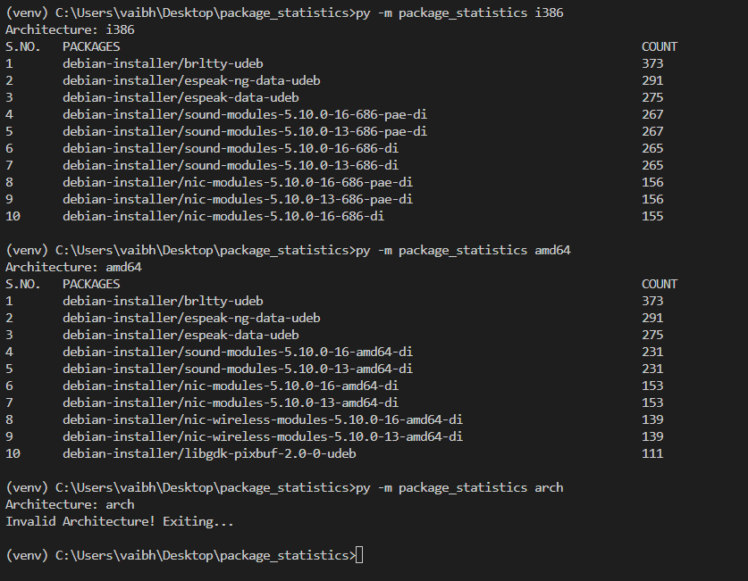

# Debian Package Statistics

A python take home exercise to get top 10 packages for a particular architecture.

## Features

* Commandline tool.
* Fetch the package from the debian contents.
* Used python package project structure to create a complete package.

## Architecture:

I started the project with the architecture design. According to problem statement, I had three things to do:
1. Take architecture inputs as a commandline arg
2. Download the compressed debian contents file. 
3. Process the file and finally show the top 10 packages in console as output

Based on the requirements I created 4 classes
1. ArgParser        To handle the commandline argumemnts and errors at that place
2. Config           To handle the config.yaml file which contains various global variables
3. Statistics       To store information about a particular architecture.
4. Contents         To store info about the debian contents file.

I also created a util file, which contains various general methods such as downloading a file etc.
Further I used the config file for general usecases such as what if we want to remove a particualr architecture or add it. What if instead of 10 we want 20 top packages.

## Project Structure:
```
├── config
│   └── config.yaml
├── package_statistics
│   ├── service
│   │   ├── impl
│   │   │   └── statistics_impl.py
│   │   ├── arg_parser.py
│   │   ├── config.py
│   │   ├── contents.py
│   │   └── statistics.py
│   └── util
│       └── util.py
├── requirements.txt
└── setup.py
```

## Steps to run the project.


1. Go to root folder of the project. 
2. Use python to create a virtual env. 

### Windows
3. py -m venv venv
4. Activate the virtual environment using.
5. venv\Scripts\activate
6. pip install -e .
7. py -m package_statistics <arch>
   eg. py -m package_statistics i386

### Linux/Mac (I use WSL)
3. python3 -m venv venv
4. Activate the virtual environment.
5. . venv/bin/activate
6. pip install -e .
7. python3 -m package_statistics <arch>
   eg. python3 -m package_statistics i386


Total Time Taken for the project is around 4-5 Hours.
The major time used was during the initial architecture design, analyzing which classes to create and then the way I should be handling errors or exceptions.
Further with the arg parse, I was new and I had to handle various stuffs like what if argument is not passed and what if multiple arguments are passed. I also wanted to make it look like a standard commandline which shows default arguments and --help too. So, it took me a while.


